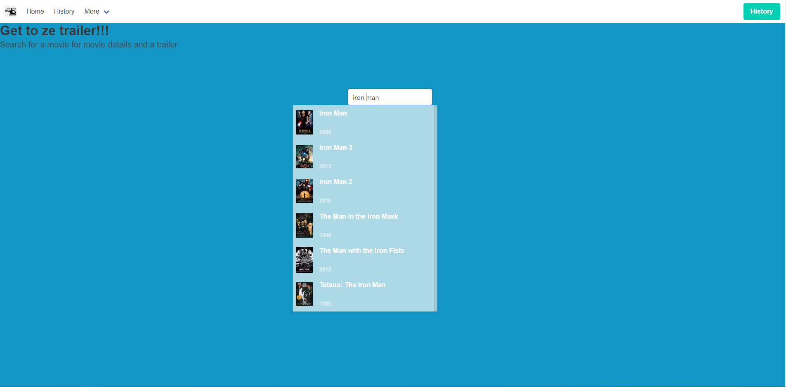
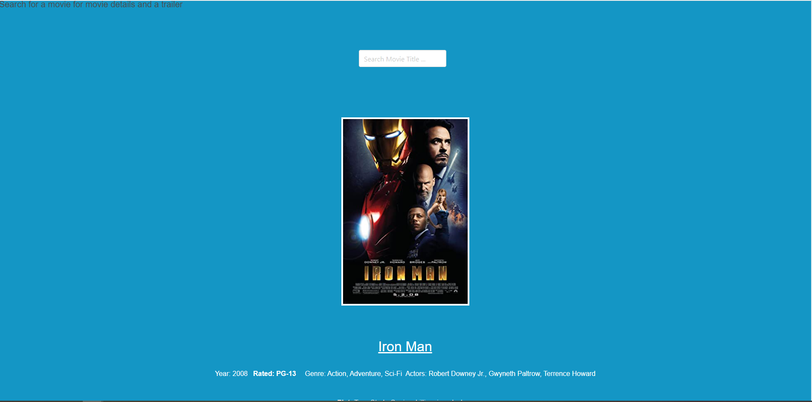
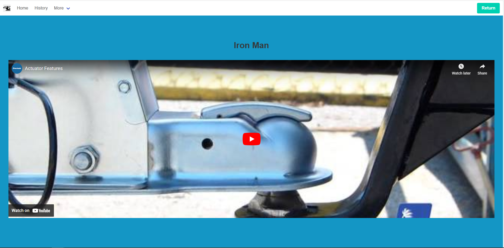

# Get To Ze Trailer

## Description
The goal for this project is for a user to search a movie title and then would display a poster and trailer of that movie along with director, genre, main actors/actresses, writers, ratings, year released, plot, etc. 

This project included a collective use of HTML, CSS, and JavaScript using one framework and two APIs. Our motivation is for users to have a "one stop shop" of information for movies they would want to know more about without looking endlessly through different links and searches. 

## Technology Used
CSS Framework: 
- [Bulma.io](https://bulma.io/documentation/)

APIs:
- [OMDb API](https://www.omdbapi.com/)
- [YouTube API](https://developers.google.com/youtube)

## Usage

User enters title of the movie and a search bar will drop down of similar movie titles

It will display movie information and poster

User clicks on the poster and it will move to another HTML page where the user can click on the trailer from YouTube

## Credits
Group Members:
- [Corey Carpenter](https://github.com/Corey-Carpenter)
- [Sylvestre Corneille](https://github.com/Sccorneille100)
- [Michael O'Sullivan](https://github.com/michaelhallosullivan)
- [Justin Sanchez](https://github.com/JustinSanchez12)

## License
MIT License
